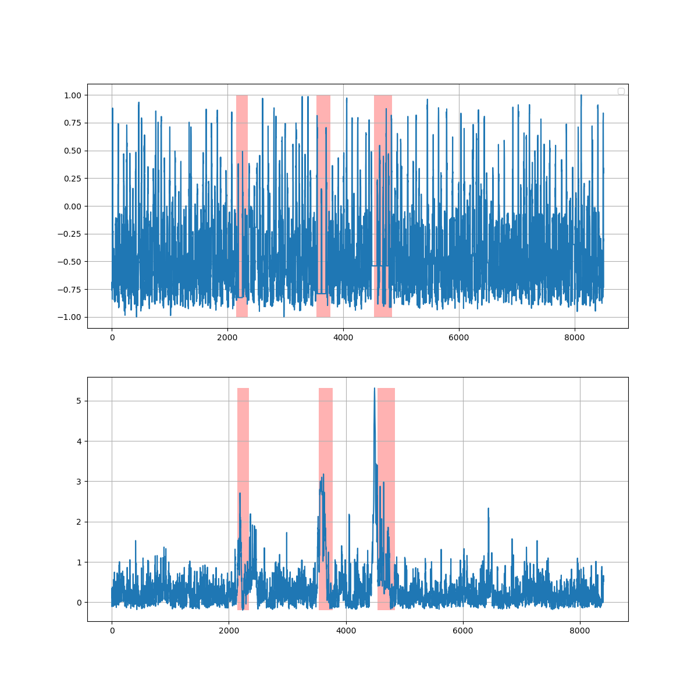
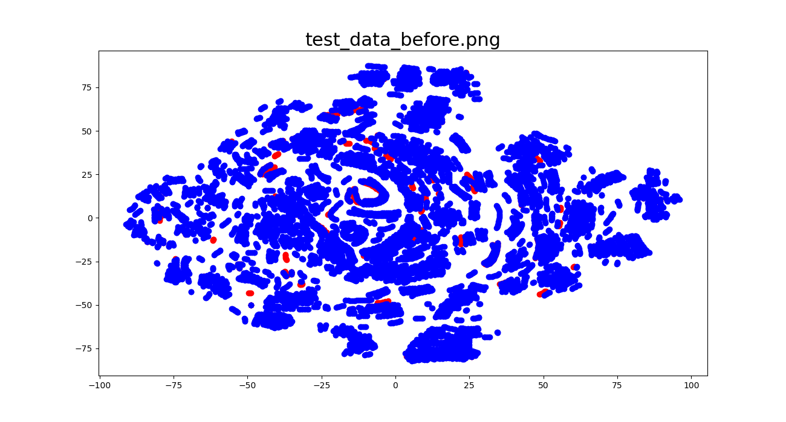
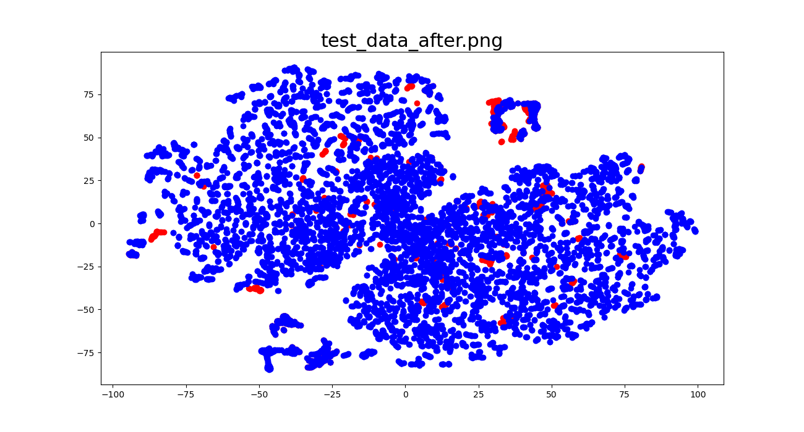
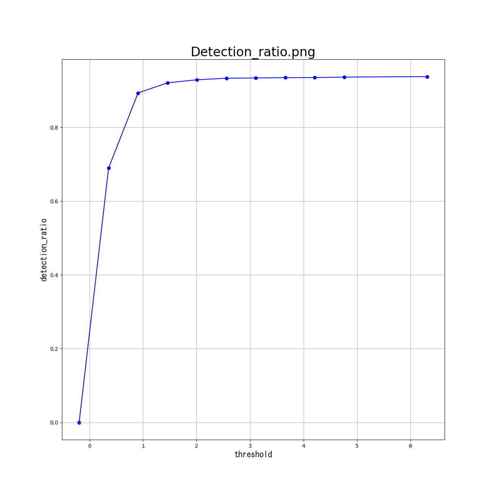
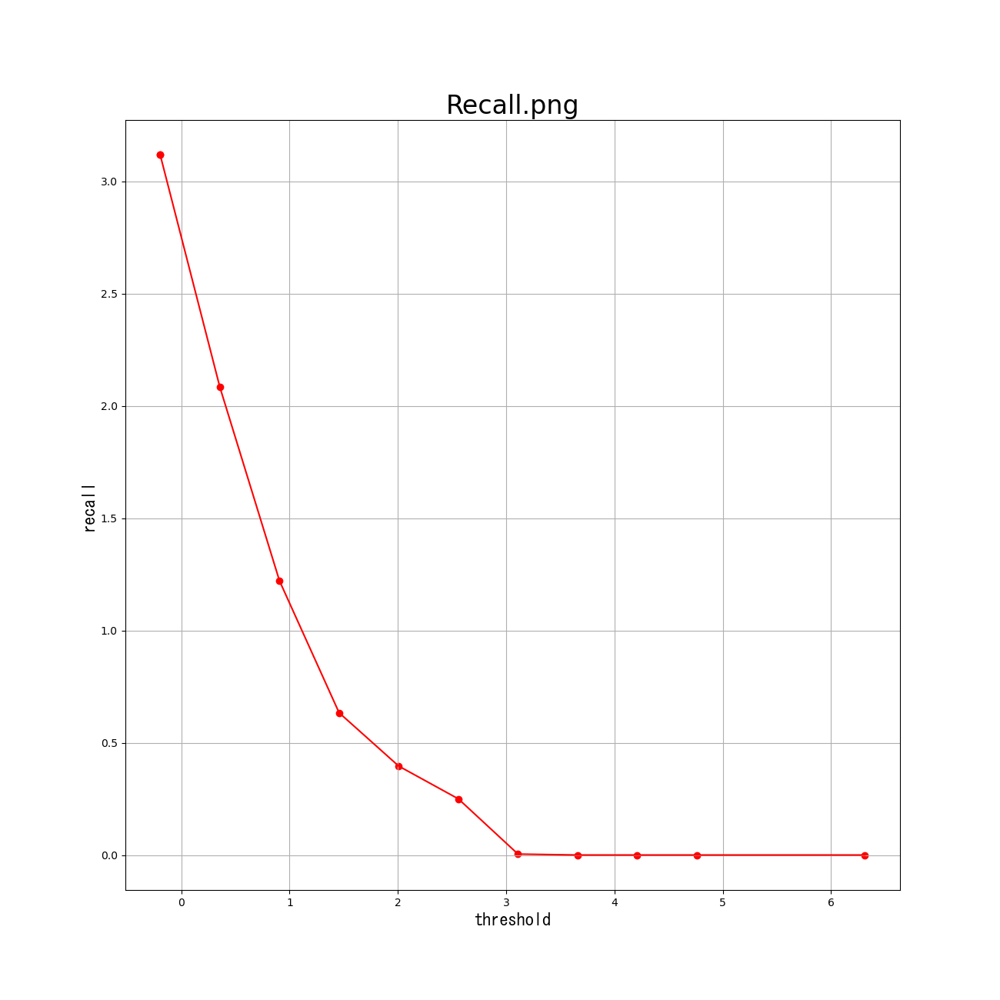
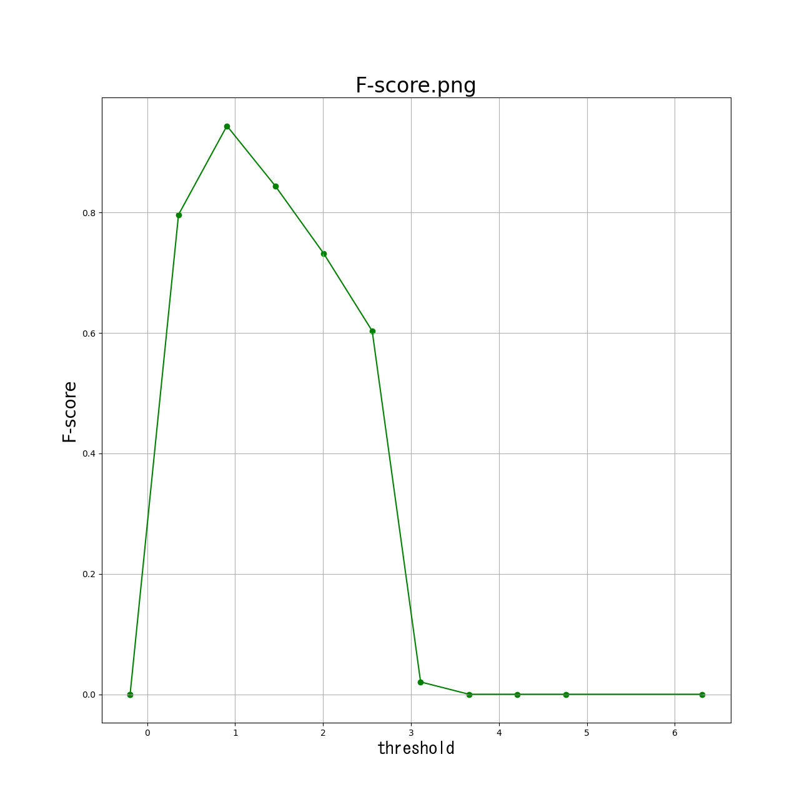
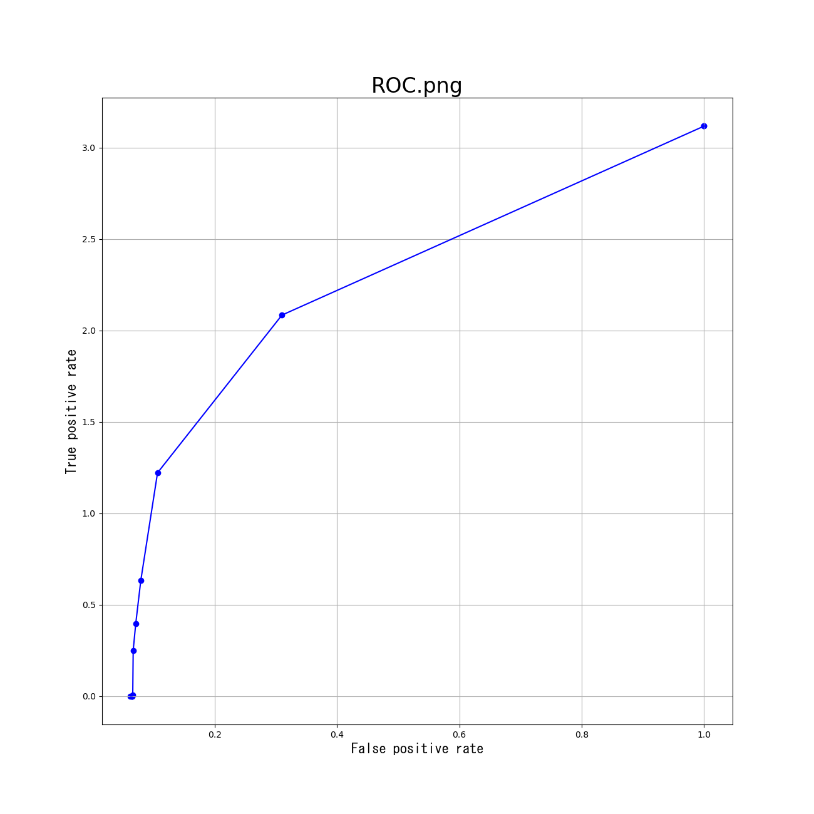
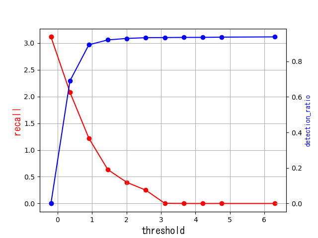

# Kerasを用いた時系列データ異常検知検証用ソルバー

## はじめに
深層学習を用いた多次元時系列データ異常検知のための検証用フレームワークです。
このフレームワークを活用することで以下の画像のように異常検知における

1. 閾値ごとの正常標本精度, 異常標本精度の算出
2. ROC曲線
3. 閾値ごとのF-score
4. t-SNEによる特徴量の可視化(2次元)

の算出、可視化を行うことが出来ます。

また以下のようにTest data(上図)と異常スコア(下図)が算出されTest data におけるtrue_anoms(赤の範囲)を実際に検知できているのか確認することが出来ます。

 

## 変更が必要なファイル
- anomaly_sequences.csv　変更方法は設定ファイルの変更を参考
- parameterfile
- input.txt　閾値の設定を行うファイル

## 出力されるファイル

- test_data_before.png　  　t-SNEを用いて学習前のTest dataにおける正常データ(青)異常データ(赤)を二次元で可視化します
- test_data_after.png     　t-SNEを用いて学習後のTest dataにおける正常データ(青)異常データ(赤)を二次元で可視化します

 

- score.png 　              Test dataと異常スコアを可視化します。またanomaly_sequences.csvで設定された異常は
                            赤枠で可視化されます。

- Detection_ratio.png       閾値ごとの正常標本精度を算出する
- recall.png                閾値ごとの異常標本精度を算出する
- Fscore.png                入力された閾値ごとのFscoreを算出しグラフとして可視化されます。
- ROS.png                   縦軸正常標本精度、横軸異常標本精度のグラフ　線分の下部面積を用いて異常検知モデルの性能を
                            測ることが出来ます
- break_even_point.png      閾値ごとの正常標本精度、異常標本精度を算出し一つのグラフとして可視化されます。
                            
 
 

## 設定ファイルの変更
### Modify the CSV file
- input ‥‥異常スコアにおける閾値を設定します
- anomaly_sequences.csv‥‥
    - 1列目　chan_id　時系列データを格納しているファイルごとの名称
    - 2列目　num_true_anoms　1つの時系列データに含まれる異常の数
    - 3列目以降　anomaly_sequence 奇数なら異常の始まるシーケンス
                                 偶数なら異常の終わるシーケンス
                                 num_true_anomsで記載した数の分だけ記載する

## 注意点
私は現在大学院に所属しPythonを学んで1年という身です。プログラムの構成また異常検知の理論の理解の浅い点が多いと考えています。本プログラムを通じてご教授頂ければ幸いです。

また本プログラムの妥当性や結果に関する判断は、使用者が行うべきものであり、私個人ははその結果に関してどのような形でも責任を負い兼ねます。ご理解のほどよろしくお願いいたします。
